# Godot Networking

## Auteurs
- [Tom DUNET](https://github.com/Oridoshi) (DUNT18030400)

## Annexe

 Sprites utilisés 

Pour ce TP, j'ai utilisé les sprites suivants qui vienne de l'asset [Tiny Swords](https://pixelfrog-assets.itch.io/tiny-swords) sur itch.io :

- Personnage :  
  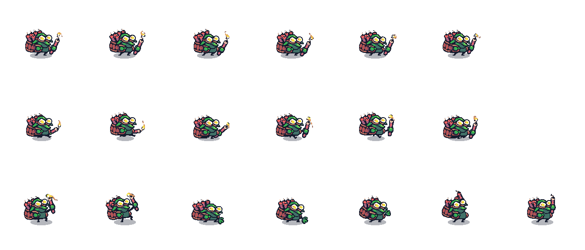
  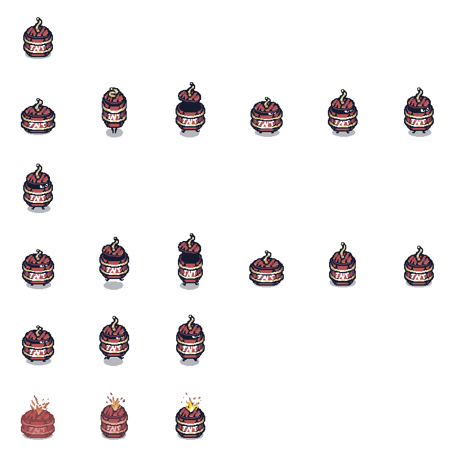
  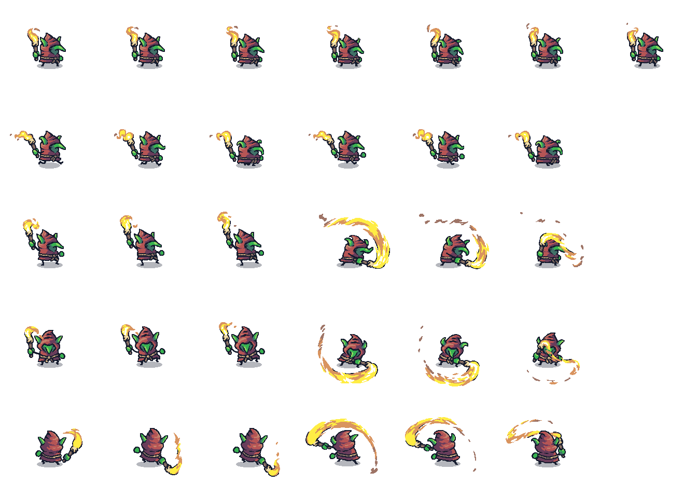
  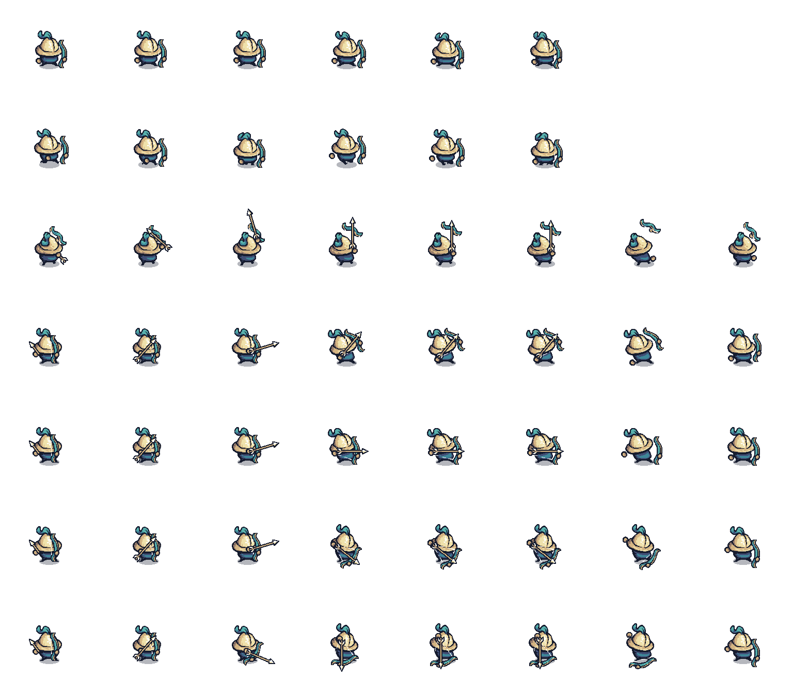
  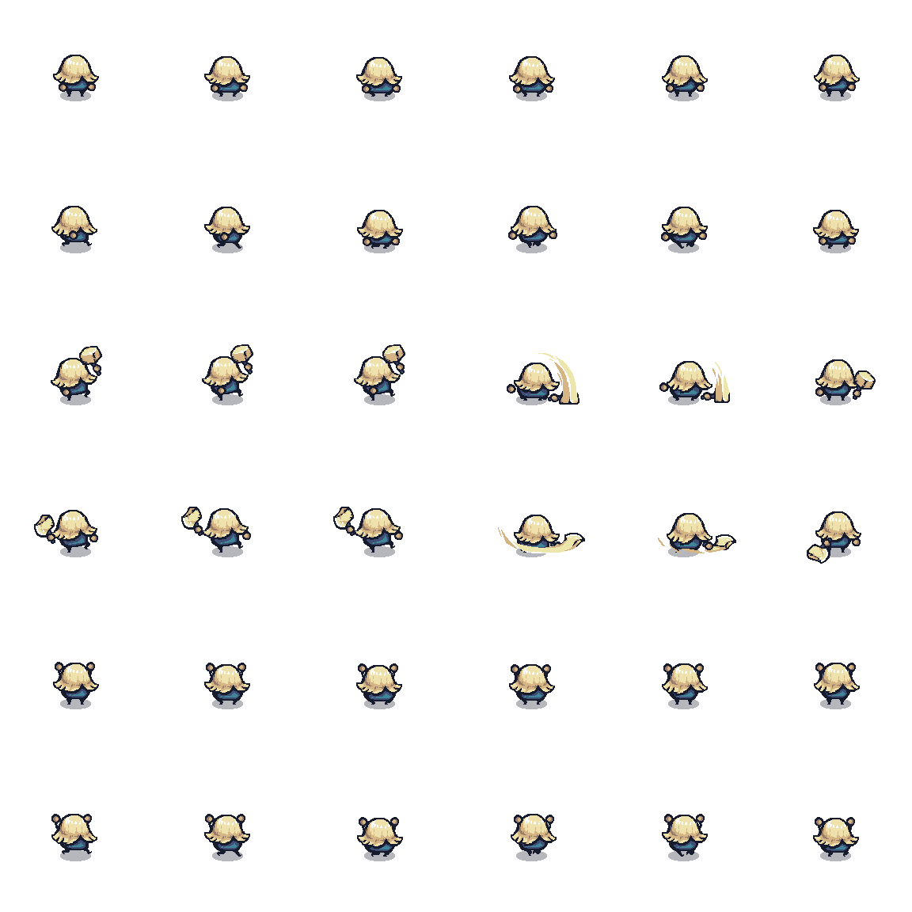
  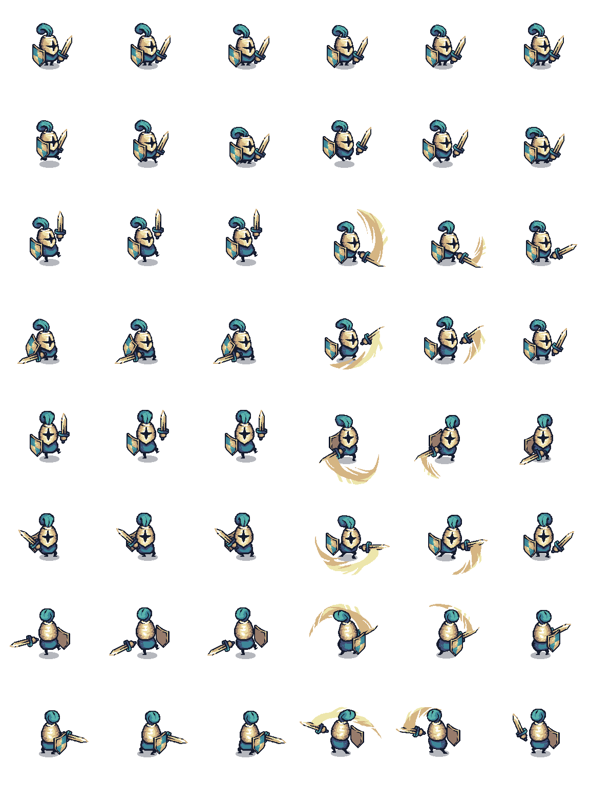

- Arbre :  
  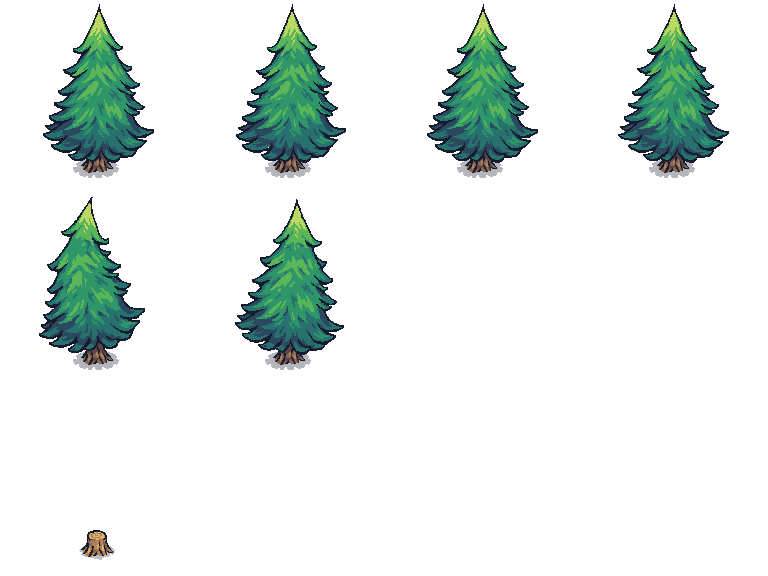

- Tour :  
  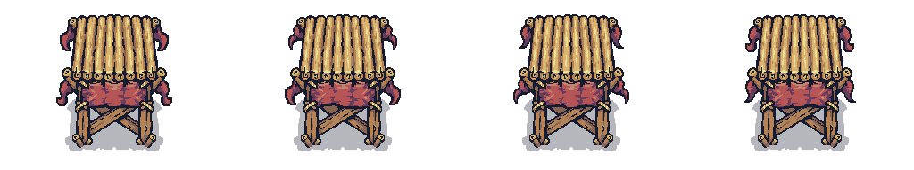

## Tiles Map utilisé
Les tiles map utilisés viennent également de l'asset [Tiny Swords](https://pixelfrog-assets.itch.io/tiny-swords) sur itch.io :
- Eau :  
  

- Eau avec des vagues :
  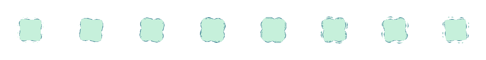

- Sol :  
  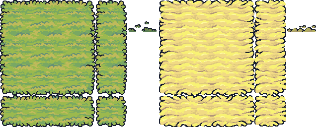

- Surélévation :  
  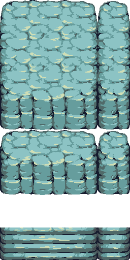

- Ombrage :  
  

- Pont :  
  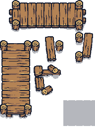

- Divers :  
  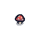
  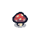
  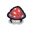
  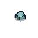
  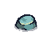
  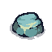
  
  
  
  
  
  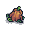
  
  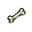
  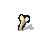
  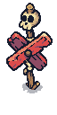

